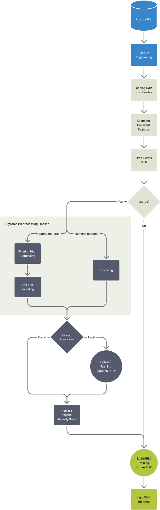
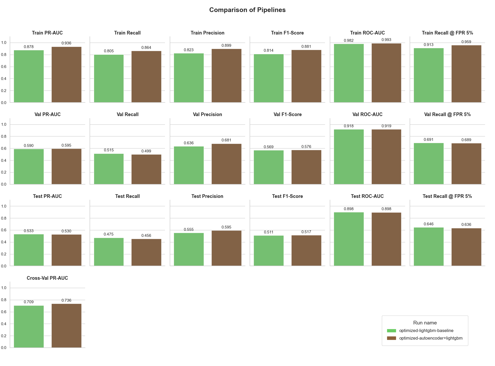
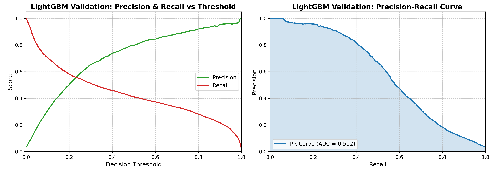
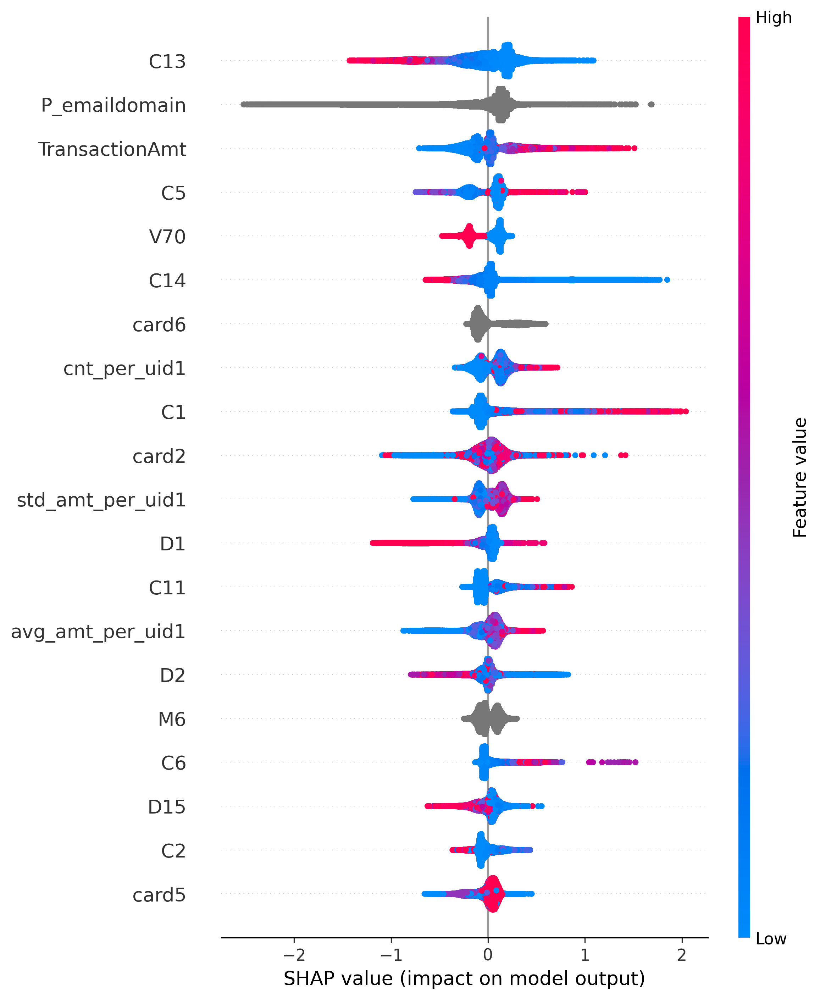
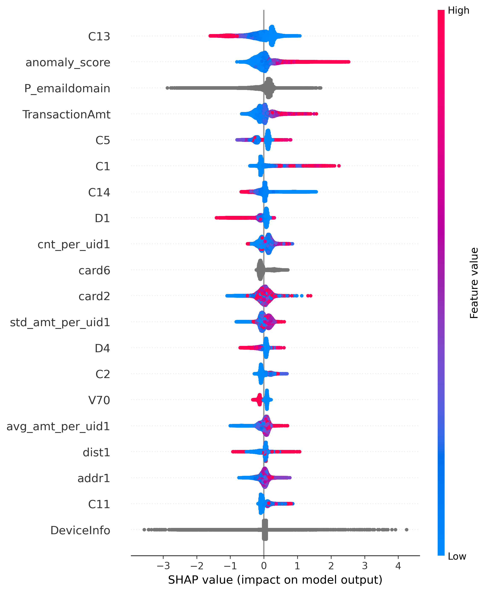
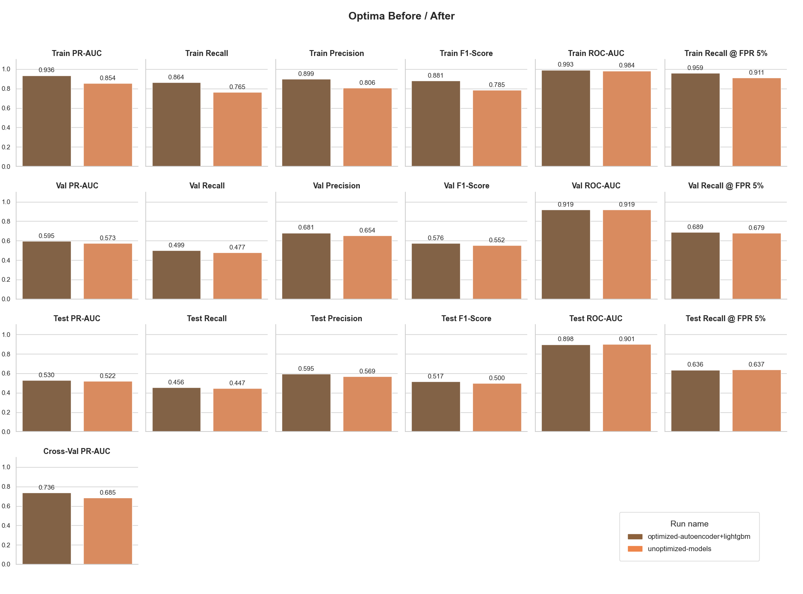
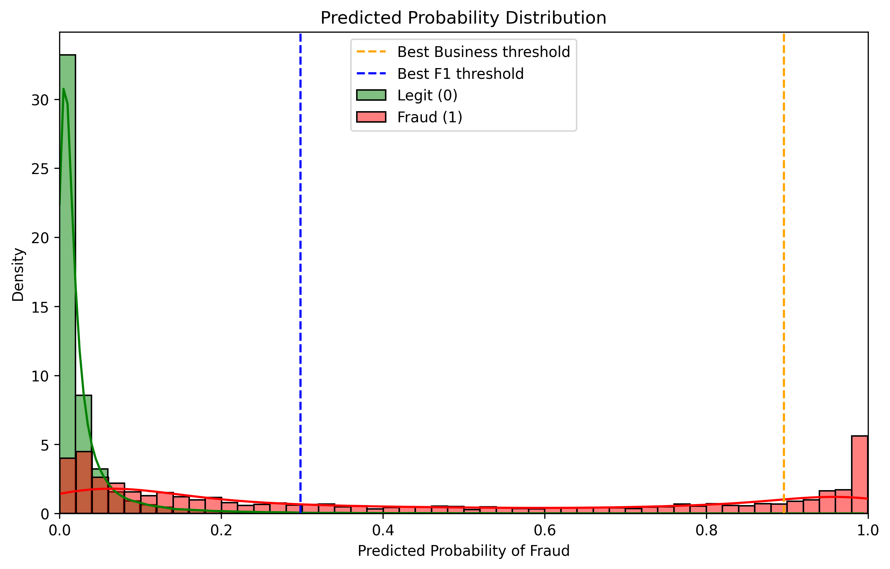
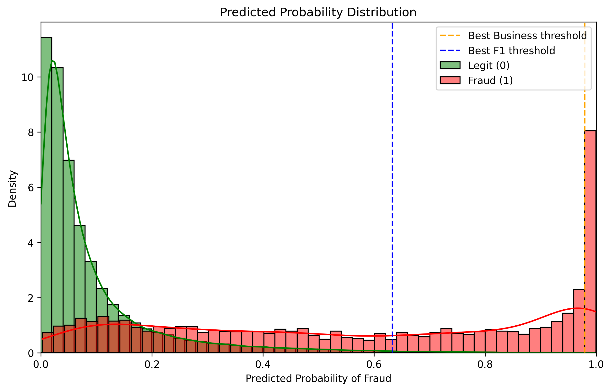
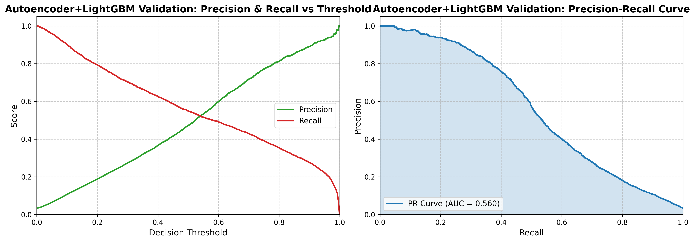
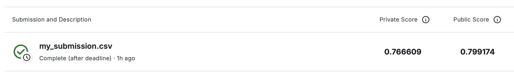

# Online Payment Fraud Detection
## Project Overview 
This is the project for online detection of fraud transactions, it was based on IEEE-CIS Fraud Detection dataset.

During R&D, I made and optimized (with Optuna) two pipelines: LightGBM only and hybrid PyTorch Autoencoder + LightGBM.
Metrics from MLflow showed that feature Anomaly Score from autoencoder strongly increased metrics on Train set, 
but on the Test set the key business-metric "Recall @ FPR 5%" was higher with baseline LightGBM pipeline (0.646 vs 0.636).
For reaching the best principles of MLOps (low latency, lightweight Docker-container, lack of need to Scaler/Imputer),
for Inference АРІ I choose the baseline LightGBM pipeline.

## Training Data Flow Diagram
<picture>
  <source media="(prefers-color-scheme: dark)" srcset="docs/diagrams/training_data_flow_diagram_dark.svg">
  <source media="(prefers-color-scheme: light)" srcset="docs/diagrams/training_data_flow_diagram_light.svg">
  
</picture>


## Technical Stack
- Infrastructure: Docker Compose, PostgreSQL, FastAPI
- ML: PyTorch, LightGBM
- MLOps & Tracking: MLflow, Optuna


## Data Pipeline & Feature Engineering
```
src/scripts/create_table_script.py
db/01_schema.sql
db/02_seed.sql
db/03_train_features.sql, db/04_test_features.sql
```

First of all, I copied the columns information from .csv, then copied all data from .csv to sql-tables. I combined train_transaction и train_identity tables by TransactionID.
My first behavioral assumption was: card1 = unique user id, _uid1_.
I tried also to fingerprint users as uid2 = card1_card2, uid3 = card1_card2_addr1, uid4 = card1_card2_addr1_Pemaildomain.
But it leaded to extreme overfitting in the future.

Then I made the aggregates by uid1 with rolling-windows.
! For prevent data leakage, I made the aggregates with rolling-windows: from the first occurrence to the current.

### Behavioral Assumptions
I made a few behavioral assumptions, the aggregates based on uid1:
- Count of transactions for the last 5m, 1h, 24h, 7d,
- Time since last transaction,
- Amount of transactions for the last hour,
- Ratio amount/average transaction per user,
- Time since last geo change,
- Novelty of the device, for each mobile and desktop type.
Then I did slight preprocessing in Pandas (dropped columns with (null ratio > 90%), sorted by transaction time).

Time series split for Train/Val/Test was used to prevent temporal leakage.

### Data Flow Diagram
```
X, y = load_data()
X_train, y_train = train_split()
X_train_nn = pytorch_preprocessing(X_train)
X_train['anomaly_score'] = anomaly_scores
train_data = prepare_data_for_lgbm(X_train)
```

## Modeling: Autoencoder + LightGBM
I made a possibility to run 2 different pipelines: LightGBM with added autoencoder and LightGBM only (baseline).
My baseline model was LightGBM. However, to help him find anomaly patterns in transactions, I made unsupervised method
of autoencoding in PyTorch. It returns a new column `anomaly_score`, and then LightGBM trains with it.
#### Autoencoder
I used bottleneck method with customizable `latent_dim` (the narrowest part).

## MLOps & Hyperparameter Tuning
I made hyperparameters optimization in this order:
1. PyTorch HPO. I found the best hyperparameters for PyTorch Autoencoder (including `latent_dim`)
2. LightGBM HPO with scores from PyTorch. I found the best hyperparameters for LightGBM with anomaly_scores taken from already optimized PyTorch Autoencoder.
3. LightGBM HPO without scores from PyTorch. I made a comparison of metrics between PyTorch+LightGBM and LightGBM only (baseline pipeline).


## Threshold Optimization (Math vs. Business)
I developed two approaches to find it using `precision_recall_curve`:
### Business-driven threshold
Business says: 'You detect a fraud. We want that no more than 5% should be false alerts, because they are good customers
who will definitely be angry and call us.' - it means that I should maximize the Recall @ FPR 5% .

However, if the business target is unreachable, mathematical threshold will be used as a fallback.

### Mathematical Threshold
It uses the f1-formula and gets a recall and a precision from the best F1-ratio.

### Predicted Probability Distribution (Density) Plot

This histogram visualizes how well the model separates the two classes by showing the distribution of predicted fraud probabilities for each class.
Each histogram is normalized independently, so the area under each distribution equals 1.
This plot helps visualize how well the model separates the two classes and where a decision threshold can be placed.
I also compared the F1-optimal threshold with a business-driven threshold.


## Final Model Evaluation
### Choosing between two pipelines

_(I made a custom script to visualize metrics from MLflow using run_id)_

As we see, the feature Anomaly Score from autoencoder strongly increased metrics on Train set, 
but on the Test set the key business-metric "Recall @ FPR 5%" was higher with baseline LightGBM pipeline (0.646 vs 0.636).
For reaching the best principles of MLOps (low latency, lightweight Docker-container, lack of need to Scaler/Imputer),
for Inference АРІ I choose the baseline LightGBM pipeline.


Accuracy metric is pretty useless in this project: dataset has only 3% of fraud. It means that model that always returns 'no fraud' will get 97% of accuracy.
Precision = 1 - False Positive Rate, percentage of amount without false alerts.
Recall = True Positive Rate, percentage of real fraud detection.
ROC-AUC = True Positive Rate / False Positive Rate, how the model classifies the data. 0.5 means random selection, 0.9+	is good.
F1 - it's a Precision and Recall harmonic ratio. However, it depends on fixed threshold value.
PR-AUC - it's a square under the curve, it doesn't depend on threshold value.
Recall@FPR - 'How many fraud alerts we detect if we allow only 1% of false alarms?'. It uses `business_fp_target`.



## SHAP Values

<p>
  
  
</p>

_SHAP values from baseline LightGBM-only pipeline / from Autoencoder + LightGBM pipeline._

As we see, anomaly_scores really helps the LightGBM model to correlate with fraud alerts (aside from the fact that baseline pipeline ended up being better).
Also we see the high correlation with features as P_emaildomain (probably anonymous domains), TransactionAmt.


## Optuna Before/After Comparison

As we see, Optuna HPO didn't show a dramatic rise of metrics on the test set; however, it has decreased the overfitting and
increased the model's stability during the cross-validation (CV PR-AUC was increased from 0.685 to 0.739).

<p>
  
  
</p>

_Predicted Probability Distribution Plot AFTER optimization / Predicted Probability Distribution Plot BEFORE optimization._

<p>
  
  
</p>

_Predicted Probability Distribution Plot AFTER optimization / Predicted Probability Distribution Plot BEFORE optimization._


## API
This is FastAPI interface which uses **lifespan** pipeline. With launch, service should load into a memory all the data from disk for an inference: models weights, meta-information from json.

### Endpoint /healthcheck (GET)
This is asynchronous function. It should return:
```
health_status = {
        "api": "ok",
        "database": "ok",
        "models": "ok"
    }
```

1. It uses an asynchronous engine `asyncpg` and tries to execute inside the database: `SELECT 1;`
2. It checks than model weights were loaded from files into a memory.

### Endpoint /predict (POST)
First of all, it has a dependency `verify_api_key`: it checks the correct password `123`. Also router checks that all the necessary data exist.
Then it sends input data and meta-data into a service `process_payment`.

### Service process_payment
It has a sub-function `apply_business_rules`: simple rules written by business that definitely leads to fraud alert.
For instance, if amount of the transaction > 500000 and it was made from a new device, it returns: "Blocked by Rule: Huge amount from new device" and returns a fraud alert.
Only if business rules were passed, inference pipeline would be started.

## What if I used PyTorch in the inference?
I would load `num_imputer` and `scaler` files with FastAPI launch. Then I would apply OHE for string values of the new transaction,
for numeric values I would firstly replace missing values with mean values (from the imputer), then apply z-score for all the numeric values.
Importantly, the last step before the pytorch inference would be reindexing the features from my previous steps with saved `final_pytorch_features`.

## Inference pipeline

## How to Run (Docker & GPU)
#### CPU Launch
```
docker-compose up -d --build
```

#### GPU launch
```
docker-compose -f docker-compose.yml -f docker-compose.gpu.yml up --build
```

#### MLflow interface
```
localhost:5001/#/experiments/1/runs
```

#### FastAPI interface
```
localhost:8000
```

#### Optuna hyperparameters optimization
```
docker-compose run --rm training python src/scripts/tune_pytorch_script.py
docker-compose run --rm training python src/scripts/tune_lgbm_script.py
```

#### Tune evaluation standalone  script
```
docker-compose run --rm training python -m src.scripts.tune_evaluation_script
```

## Kaggle Results
This project is based on the Kaggle IEEE-CIS Fraud Detection dataset. The model achieved a score of **0.799174** on the public leaderboard.
However, the primary focus of this project was not to obtain a high score, but to build a complete, production-ready MLOps pipeline.


## Limitations, Known Issues
#### Local launch on macOS: SIGSEGV when running LightGBM after PyTorch

On macOS, PyTorch and LightGBM both ship their own OpenMP runtime (`libomp`),
which causes a segfault when both are used in the same process.

My first solution was to limit `num_threads=1` for LightGBM on macOS, which disables the conflicting OpenMP initialization.
However, I decided to not allow to launch this project locally, only Docker (Linux) runs allowed with full multi-threading.


Чему я научился новому?
1. Высокое заполнение ram, поэтому периодическое ручное удаление тяжелых элементов и gc.collect. High cardinality. Конвертация float64-float32. Отслеживание потребляемого RAM
2. Проблема с портом 5000 на macOS, поэтому mapping выходного порта 5001:5000
3. Docker: порядок выполнения сервисов, conditions, причем выполнение своего тестового запроса.
4. Проблема OpenMP на macOS
5. Уровни logging
6. Чтение большого read_sql через chunksize
7. Ручное написание аналога train_test_split, работающего по временному ряду (через iloc)
8. Автоматическая сборка requirements.txt через pipreqs
9. Проверка fraud drift после разделения данных
10. Autoencoder (nn на основе самой себя)
11. Анализ SHAP
12. Динамический Dockerfile (с override)