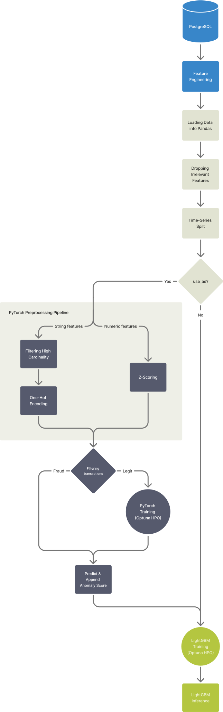
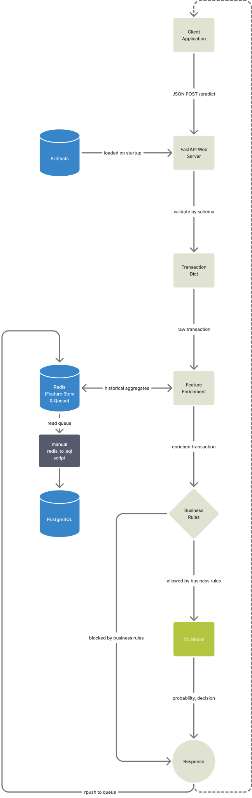
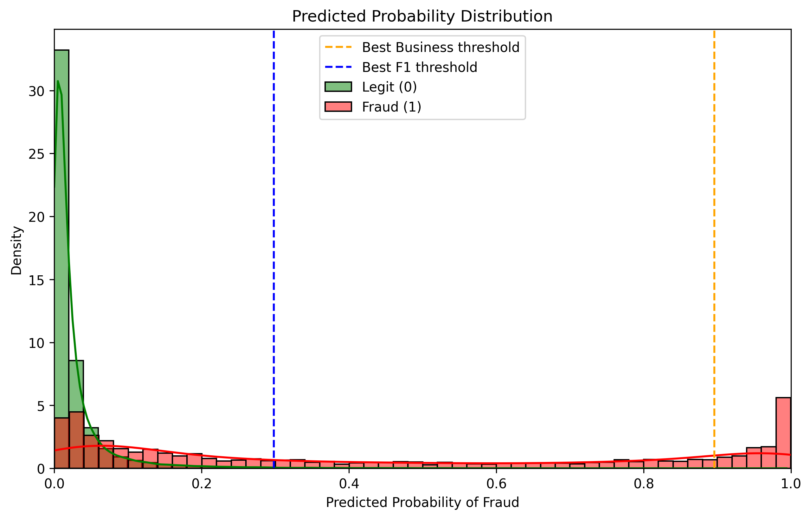
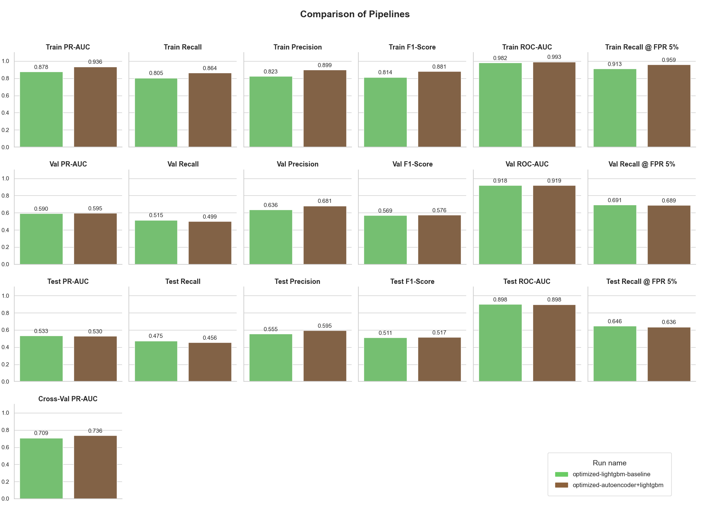
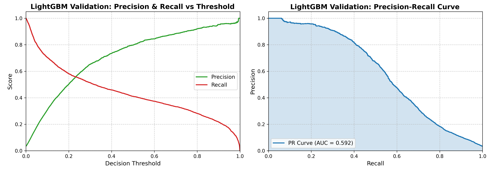
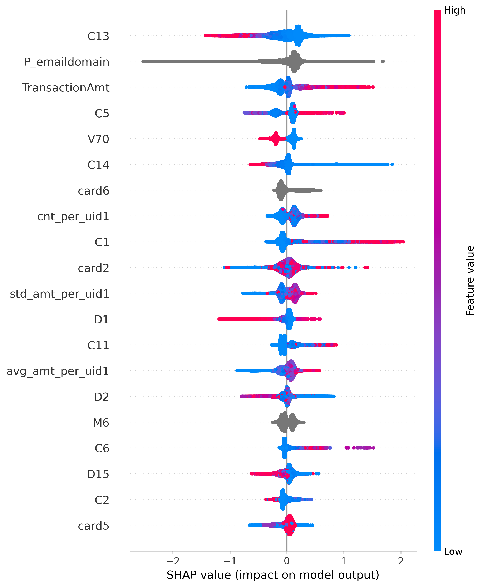
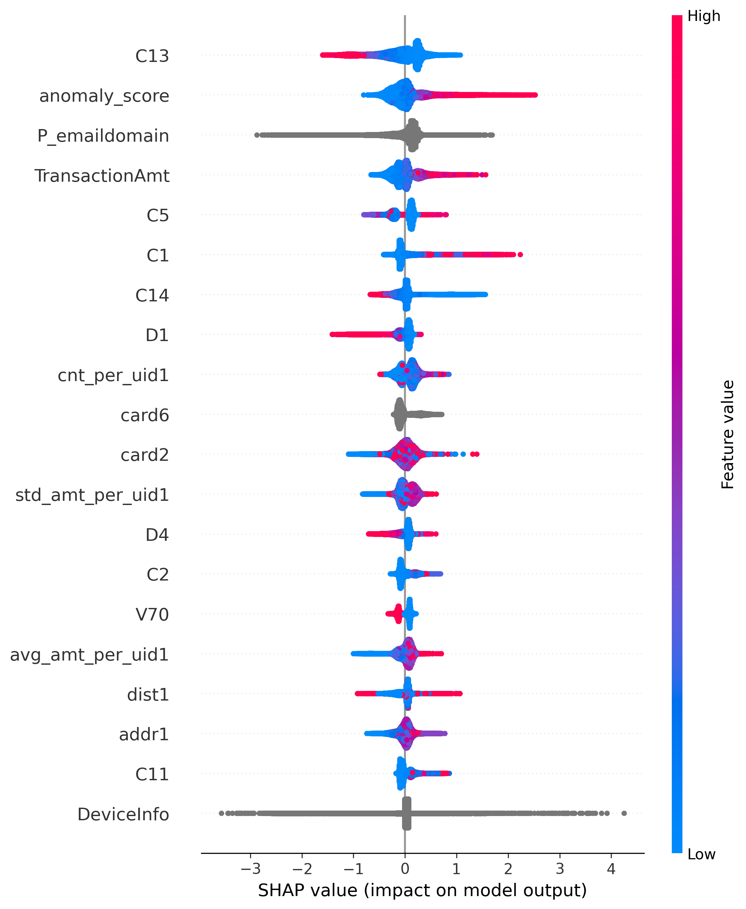
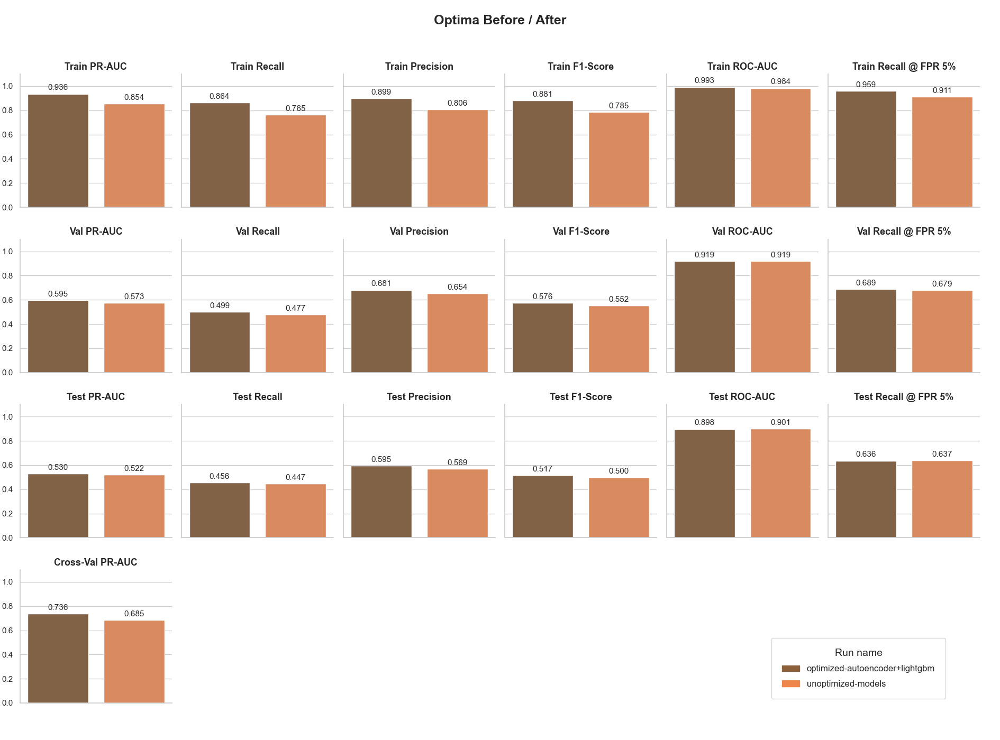
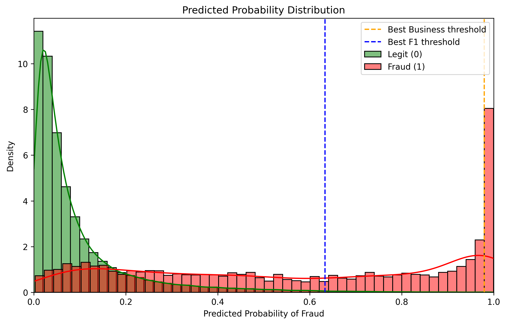
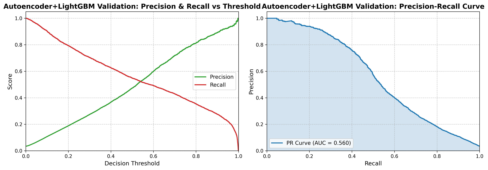

# Online Payment Fraud Detection


An end-to-end MLOps pipeline for real-time fraud detection, based on IEEE-CIS Fraud Detection dataset.

During R&D, I made and optimized (with Optuna) two pipelines: LightGBM only and hybrid PyTorch Autoencoder + LightGBM.
Metrics from MLflow showed that feature Anomaly Score from autoencoder strongly increased metrics on Train set, 
but on the Test set the key business-metric "Recall @ FPR 5%" was higher with baseline LightGBM pipeline (0.646 vs 0.636).
To adhere to MLOps best practices (low latency, lightweight Docker container, no need for Scaler/Imputer during inference), I chose the baseline LightGBM pipeline for the production API.

## Training Data Flow Diagram
<picture>
  <source media="(prefers-color-scheme: dark)" srcset="docs/diagrams/training_data_flow_diagram_dark.svg">
  <source media="(prefers-color-scheme: light)" srcset="docs/diagrams/training_data_flow_diagram_light.svg">
  
</picture>

## Inference Data Flow Diagram
<picture>
  <source media="(prefers-color-scheme: dark)" srcset="docs/diagrams/inference_data_flow_diagram_dark.svg">
  <source media="(prefers-color-scheme: light)" srcset="docs/diagrams/inference_data_flow_diagram_light.svg">
  
</picture>

## Technical Stack
- Infrastructure: Docker Compose, PostgreSQL, FastAPI, Redis
- ML: PyTorch, LightGBM
- MLOps & Tracking: MLflow, Optuna

## Key Learnings
1. Overcame Out-Of-Memory errors during heavy feature loading by implementing SQL chunking (`chunksize`), downcasting datatypes (`float64` to `float32`), and manual garbage collection.
2. Prevented data leakage by developing time-series train/test split via iloc.
3. Built dynamic Dockerfiles with override capabilities and orchestrated container startup sequences using custom healthchecks.
4. Resolved macOS-specific OpenMP segmentation faults (LightGBM vs PyTorch collision), and isolated port binding conflicts.
5. Designed an unsupervised PyTorch Autoencoder
6. Leveraged SHAP values to explain predictions.


## Data Pipeline & Feature Engineering
```
src/scripts/create_table_script.py
db/01_schema.sql
db/02_seed.sql
db/03_train_features.sql, db/04_test_features.sql
```

First, I migrated the schema and data from CSV files to PostgreSQL tables. I combined `train_transaction` and `train_identity` tables by TransactionID.
My first behavioral assumption was: card1 = unique user id, _uid1_.
I tried also to fingerprint users as `uid2 = card1_card2`, `uid3 = card1_card2_addr1`, `uid4 = card1_card2_addr1_Pemaildomain`.
However, this led to extreme overfitting, so I kept only the `uid1` identification.

Then I made the aggregates by uid1 with rolling-windows.
Note: To prevent data leakage, I calculated the rolling-windows aggregates from the first occurrence up to the row preceding the current one (`ROWS BETWEEN UNBOUNDED PRECEDING AND 1 PRECEDING`)

### Behavioral Assumptions
I made a few behavioral assumptions, the aggregates based on uid1:
- Count of transactions for the last 5m, 1h, 24h, 7d,
- Time since last transaction,
- Amount of transactions for the last hour,
- Ratio amount/average transaction per user,
- Time since last geo change,
- Novelty of the device, for each mobile and desktop type.
Then I did slight preprocessing in Pandas (dropped columns with (null ratio > 90%), sorted by transaction time).

Time series split for Train/Val/Test was used to prevent temporal leakage.

## Modeling: Autoencoder + LightGBM
I implemented two training pipelines: LightGBM with added autoencoder and LightGBM only (baseline).
My baseline model was LightGBM. However, to help it capture anomaly patterns, I developed an unsupervised PyTorch Autoencoder. It returns a new column `anomaly_score`, and then LightGBM trains with it.

#### PyTorch Data Preprocessing
My strategy was:
1. Do One-Hot Encoding for string features
2. Make Imputing and Scaling for numeric features (replace NaN values with mean and calculate std)
3. Save the list of final features for the inference
4. Save Imputer and Scaler for the inference

#### Autoencoder
I used a bottleneck method with customizable `latent_dim` (the narrowest part).

## MLOps & Hyperparameter Tuning
I conducted three hyperparameter tuning phases:
1. PyTorch HPO. I found the best hyperparameters for PyTorch Autoencoder (including `latent_dim`)
2. LightGBM HPO with scores from PyTorch. I found the best hyperparameters for LightGBM with anomaly_scores taken from already optimized PyTorch Autoencoder.
3. LightGBM HPO without scores from PyTorch. 
After that, I made a comparison of metrics between PyTorch+LightGBM and LightGBM only (baseline pipeline).


## Threshold Optimization (Math vs. Business)
I developed two approaches to find it using `precision_recall_curve`:
### Business-driven threshold
The business requirement was: 'No more than 5% of flagged transactions should be false positives, to avoid blocking and frustrating legitimate customers.' - it means that I should maximize the Recall @ FPR 5% .
However, if the business target is unreachable, mathematical threshold will be used as a fallback.

### Mathematical Threshold
It uses the f1-formula and gets a recall and a precision from the best F1-ratio.

### Predicted Probability Distribution (Density) Plot

This histogram visualizes how well the model separates the two classes by showing the distribution of predicted fraud probabilities for each class.
Each histogram is normalized independently, so the area under each distribution equals 1.
This plot helps visualize how well the model separates the two classes and where a decision threshold can be placed.
I also compared the F1-optimal threshold with a business-driven threshold.


## Final Model Evaluation
### Choosing between two pipelines

_(Visualize metrics from MLflow using different run_id)_

As we see, the feature Anomaly Score from autoencoder strongly increased metrics on Train set, 
but on the Test set the key business-metric "Recall @ FPR 5%" was higher with baseline LightGBM pipeline (0.646 vs 0.636).
For reasons of low latency, lightweight Docker-container, lack of need to Scaler/Imputer in the inference, I finally choose the baseline LightGBM pipeline.


#### Metrics Description
- Accuracy metric is pretty useless in this project: dataset has only 3% of fraud. It means that model that always returns 'no fraud' will get 97% of accuracy.
- Precision - percentage of true fraud among all flagged transactions (minimizes false alarms).
- Recall (True Positive Rate) - percentage of actual fraud successfully detected.
- ROC-AUC = True Positive Rate / False Positive Rate, how the model classifies the data. 0.5 means random selection, 0.9+	is good.
- F1 - it's a Precision and Recall harmonic ratio. However, it depends on fixed threshold value.
- PR-AUC - Area Under the Precision-Recall curve; it evaluates the model independently of the decision threshold.
- Recall@FPR - 'How many fraud alerts we detect if we allow only X% of false alarms?'. It uses `business_fp_target`.



## SHAP Values

<p>
  
  
</p>

_SHAP values from baseline LightGBM-only pipeline / from Autoencoder + LightGBM pipeline._

As we see, `anomaly_score` really helps the LightGBM model to correlate with fraud alerts (aside from the fact that baseline pipeline ended up being better).
Also we see the high correlation with features as P_emaildomain (probably anonymous domains), TransactionAmt.


## Optuna Before/After Comparison

As we see, Optuna HPO didn't show a dramatic rise of metrics on the test set; however, it has increased the model's stability during the cross-validation (CV PR-AUC was increased from 0.685 to 0.739).

<p>
  
  
</p>

_Predicted Probability Distribution Plot AFTER optimization / Predicted Probability Distribution Plot BEFORE optimization._

<p>
  
  
</p>

_Predicted Probability Distribution Plot AFTER optimization / Predicted Probability Distribution Plot BEFORE optimization._

## PSI
Basic PSI monitoring was developed by simple script (runs manually) which calculates PSI between train and test data, 
and then prints top affecting features (in case of PSI > 0.1).
It helps to monitor a degradation of the model in production.

## Redis
A major challenge was calculating aggregates for incoming transactions in real-time. Calculating aggregates in PostgreSQL is slow and unacceptable for the inference,
so I needed to calculate aggregates on the fly. That's how I added Redis to the project, which fetches aggregates in O(1) time.

### Cache Warming
Because I needed to calculate historical aggregates on the new transactions and on the past transactions, I needed to preload past
transactions from SQL database in Redis database. I made an SQL query to load lifetime statistics (last transaction time, transaction count,
the sum of all transactions). I also made a query to fetch all the information about transactions and devices from the past 7 days.
Then this data is loaded to Redis through pipeline.

### Aggregates calculation
- Before adding a new transaction, I read the time of the last transaction (`hget`, `hset`). 
- I added the transaction amount to the sum of all (`hincrbyfloat`).
- To check for new devices, I use a signature devicetype:deviceinfo and then just check the presence (`sismember`). And after this, I created a zkey 'devicetype:deviceinfo: timestamp' for calculating time since last geo change.
- I calculated rolling windows through `zrange` and different ranges.
- Also I stored the zkeys 'transaction_id:transaction_amt: now' and subsequently calculated the sum of transactions from the last hour in Python.

### Flushing back to SQL
I implemented this feature through a manual script which can be launched on demand (e.g. at off-peak hours).
When Redis receives a new transaction, it copies it to the list `manual_tx_queue`. 
My script fetches it, puts it to the PostgreSQL database and flushes the queue. Fetching is implemented via `lrange`, flushing is implemented via `ltrim`.

## API
The FastAPI application utilizes the **lifespan** context manager. On startup, the service loads model weights and JSON metadata into memory.

### Endpoint /healthcheck (GET)
This is asynchronous function.

1. It uses an asynchronous engine `asyncpg` and tries to execute inside the database: `SELECT 1;`
2. It checks that model weights were loaded into memory.

### Endpoint /predict (POST)
First of all, it has a dependency `verify_api_key`: it checks the correct password `123`. Also router checks that all the necessary data exist.
Then it sends input data and meta-data into a service `process_payment`.

### Service process_payment
It has a sub-function `apply_business_rules`: simple rules written by business that definitely leads to fraud alert.
For instance, if amount of the transaction > 500000 and it was made from a new device, it returns: "Blocked by Rule: Huge amount from new device" and returns a fraud alert.
The ML inference pipeline is triggered only if the transaction passes the business rules.

### Graceful Degradation
If the inference pipeline falls by any reason, graceful degradation function will start. It contains simple rules.

## What if I used PyTorch in the inference?
I would load `num_imputer` and `scaler` files with FastAPI launch. Then I would apply OHE for string values of the new transaction,
for numeric values I would firstly replace missing values with mean values (from the imputer), then apply z-score for all the numeric values.
Importantly, the last step before the pytorch inference would be reindexing the features from my previous steps with saved `final_pytorch_features`.

## Unit Tests
### API Tests
It tests FastAPI interface: blocking by business rules and required fields by Pydantic schema.
It uses pytest fixture to substitute required ML model and Redis.

### Redis Test
It uses FakeAsyncRedis and my `get_and_update_aggregates` function to check the calculation of aggregates with adding few transaction.

### ML Inference Test
It receives knowingly fraud or legit transactions (taken from train dataset) and checks what it will return.

### E2E Test
It combines API and ML inference testing: it sends knowingly fraud transaction through FastAPI interface to the endpoint and checks
what it will return.

## Response Examples

### Healthcheck
```
health_status = {
        "api": "ok",
        "database": "ok",
        "models": "ok",
        "redis": "ok"
    }
```
### Fraud Transaction
```
{
  "is_fraud": true,
  "fraud_probability": 0.9113,
  "action": "BLOCK",
  "reason": "Fraud (Blocked by ML, probability: 91.1%)",
  "latency_ms": 79.01
}
```

### Legit Transaction
```
{
  "is_fraud": false,
  "fraud_probability": 0.0053,
  "action": "APPROVE",
  "reason": "Legit (Passed ML)",
  "latency_ms": 77.58
}
```


## Limitations, Known Issues
#### Local launch on macOS: SIGSEGV when running LightGBM after PyTorch

On macOS, PyTorch and LightGBM both ship their own OpenMP runtime (`libomp`),
which causes a segfault when both are used in the same process.

My first solution was to limit `num_threads=1` for LightGBM on macOS, which disables the conflicting OpenMP initialization.
However, I decided to not allow to launch this project locally, only Docker (Linux) runs allowed with full multi-threading.

## How to Run
#### CPU Launch
```
docker-compose up -d --build
```

#### GPU launch
```
docker-compose -f docker-compose.yml -f docker-compose.gpu.yml up --build
```

#### MLflow interface
```
localhost:5001/#/experiments/1/runs
```

#### FastAPI interface
```
localhost:8000
```

#### Optuna hyperparameters optimization
```
docker-compose run --rm training python src/scripts/tune_pytorch_script.py
docker-compose run --rm training python src/scripts/tune_lgbm_script.py
```

#### PSI calculation script
```
docker-compose run --rm training python src/scripts/data_drift_script.py
```

#### Redis to SQL script
```
docker-compose run --rm fraud_redis python src/redis/redis_to_sql.py
```

## Kaggle Results
This project is based on the Kaggle IEEE-CIS Fraud Detection dataset. The model achieved a score of **0.799174** on the public leaderboard.
However, the primary focus of this project was not to obtain a high score, but to build a complete, production-ready MLOps pipeline.